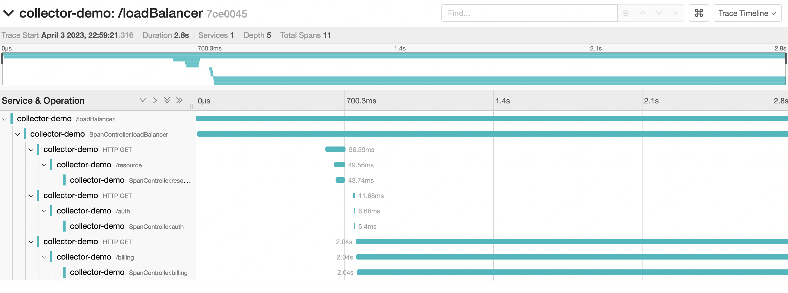
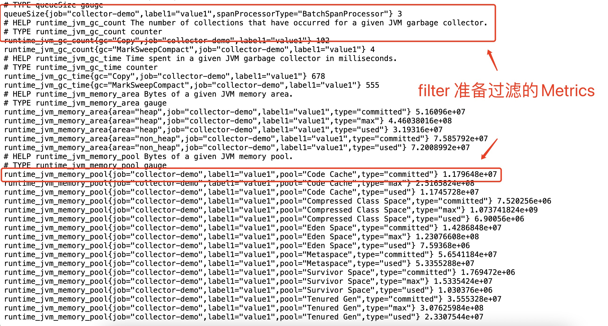
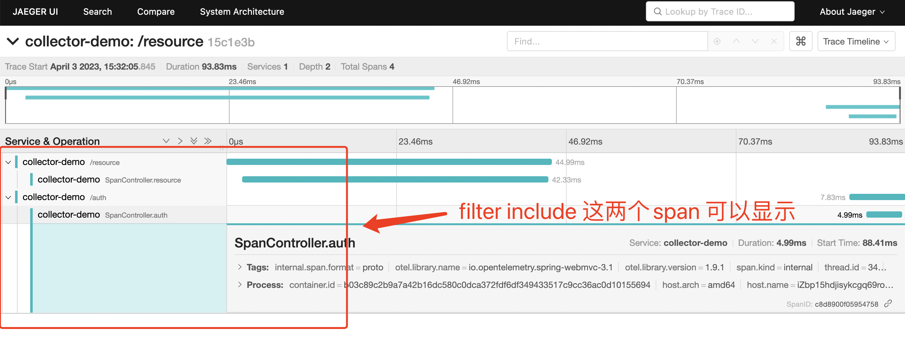
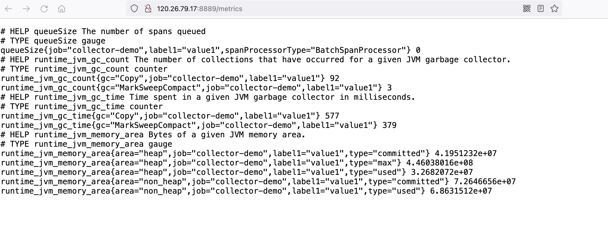

<a name="wSh88"></a>
# OpenTelemetry Collector Demo
<a name="XGdFY"></a>
## Introduction
OpenTelemetry Collector 插件介绍


## Processor
### filterprocessor
- Collector 添加 `processors`
```yaml
processors:
  filter/jvmexpr:
    metrics:
      exclude:
        match_type: expr
        ## 过滤指标规则demo ,Promethus 规则'-' 转换成 '.'
        expressions:
          - MetricName == "runtime.jvm.gc.count" && Label("label1") == "value1"
  filter/jvmstrict:
    metrics:
      exclude:
        match_type: strict
        metric_names:
          - runtime.jvm.memory.pool
  filter/spansdemo:
    ## 过滤span计划
    spans:
      include:
        match_type: regexp
        span_names:
          - resource.*
          - .*auth.*
```
- Collector `pipelines` 添加 `processor: [filter/*]`,对应的filter在pipeline中顺序依次执行
```yaml
service:
  extensions: [pprof,health_check]
  pipelines:
    traces:
      receivers: [otlp]
      processors: [filter/spansdemo]
      exporters: [jaeger,logging]
    metrics:
      receivers: [otlp]
      processors: [batch,filter/jvmexpr,filter/jvmstrict]
      exporters: [prometheus,logging]
```
- 生效前: 
  
  
- 生效后: 
  
  