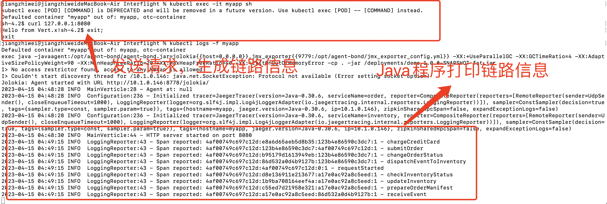
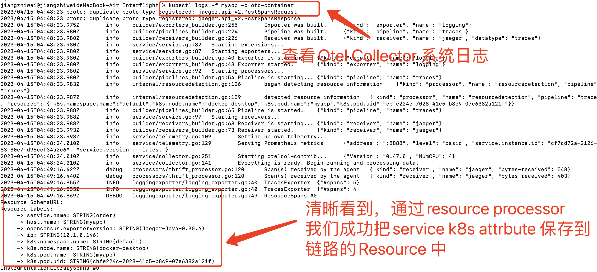

<a name="wSh88"></a>
# OpenTelemetry Collector Demo
<a name="XGdFY"></a>
## Introduction
OpenTelemetry Collector 插件介绍


## Processor
### filterprocessor
- Collector 添加 `processors`
```yaml
processors:
  filter/jvmexpr:
    metrics:
      exclude:
        match_type: expr
        ## 过滤指标规则demo ,Promethus 规则'-' 转换成 '.'
        expressions:
          - MetricName == "runtime.jvm.gc.count" && Label("label1") == "value1"
  filter/jvmstrict:
    metrics:
      exclude:
        match_type: strict
        metric_names:
          - runtime.jvm.memory.pool
  filter/spansdemo:
    ## 过滤span计划
    spans:
      include:
        match_type: regexp
        span_names:
          - resource.*
          - .*auth.*
```
- Collector `pipelines` 添加 `processor: [filter/*]`,对应的filter在pipeline中顺序依次执行
```yaml
service:
  extensions: [pprof,health_check]
  pipelines:
    traces:
      receivers: [otlp]
      processors: [filter/spansdemo]
      exporters: [jaeger,logging]
    metrics:
      receivers: [otlp]
      processors: [batch,filter/jvmexpr,filter/jvmstrict]
      exporters: [prometheus,logging]
```
- 生效前: 
  
  
- 生效后: 
  
  


## Processor
### resourcedetectionprocessor
resourcedetectionprocessor:可以在 K8s Sidecar 模式下很方便自动关联 service 对应的 K8s attrbutes 信息
https://github.com/open-telemetry/opentelemetry-collector-contrib/tree/main/processor/resourcedetectionprocessor
- Collector 添加 `resourcedetectionprocessor`
```yaml
    receivers:
      jaeger:
        protocols:
          thrift_compact:

    processors:
      resourcedetection:
        detectors: [env]
        timeout: 2s
        override: false

    exporters:
      ##设置exporters上报 collector 控制台信息
      logging:
        loglevel: "debug"

    service:
      pipelines:
        traces:
          receivers: [jaeger]
          processors: [resourcedetection]
          exporters: [logging]
      ##设置 Collector log level
      telemetry:
        logs:
          level: "debug"      
```
- 直接运行`kubectl` demo 脚本:demo 运行Java程序 `vertx-create-span:operator-e2e-tests`，通过Sidecar 模式注入探针， 最后链路数据上报Collector
``` shell
kubectl apply -f - <<EOF
apiVersion: opentelemetry.io/v1alpha1
kind: OpenTelemetryCollector
metadata:
  name: sidecar-for-my-app
spec:
  mode: sidecar
  ##0.47.0 版本好像都有点问题
  image: ghcr.io/open-telemetry/opentelemetry-collector-releases/opentelemetry-collector-contrib:0.47.0
  config: |
    receivers:
      jaeger:
        protocols:
          thrift_compact:

    processors:
      resourcedetection:
        detectors: [env]
        timeout: 2s
        override: false         

    exporters:
      ##设置exporters上报 collector 控制台信息
      logging:
        loglevel: "debug"    

    service:
      pipelines:
        traces:
          receivers: [jaeger]
          processors: [resourcedetection]
          exporters: [logging]
      ##设置 Collector log level
      telemetry:
        logs:
          level: "debug"               
  EOF

  kubectl apply -f - <<EOF
apiVersion: v1
kind: Pod
metadata:
  name: myapp
  annotations:
    sidecar.opentelemetry.io/inject: "true"
spec:
  containers:
    - name: myapp
      image: jaegertracing/vertx-create-span:operator-e2e-tests
      ports:
        - containerPort: 8080
          protocol: TCP
  EOF
```
- 进入Pod 内部Java 程序，发请求生成链路数据:
  
- 通过Otel Collector 控制台日志，看到通过`resourcedetection`自动关联应用程序的 K8s attributes,并保存到链路信息中:
  
注意: `resourcedetectionprocessor` 只支持Otel Collector的sidecar模式，如果你部署方式是`Daemonset mode`，可以用`k8sattributes processor`插件
